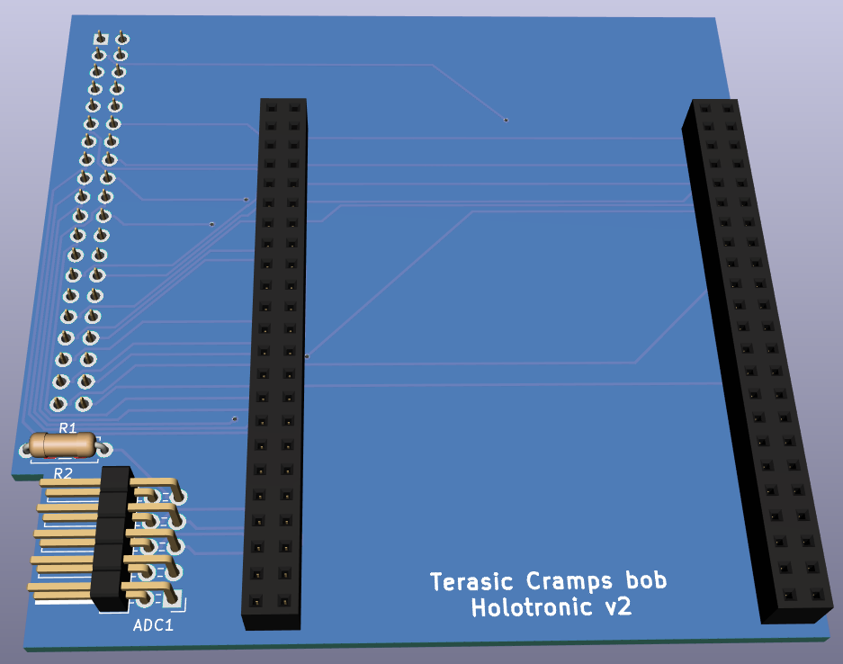
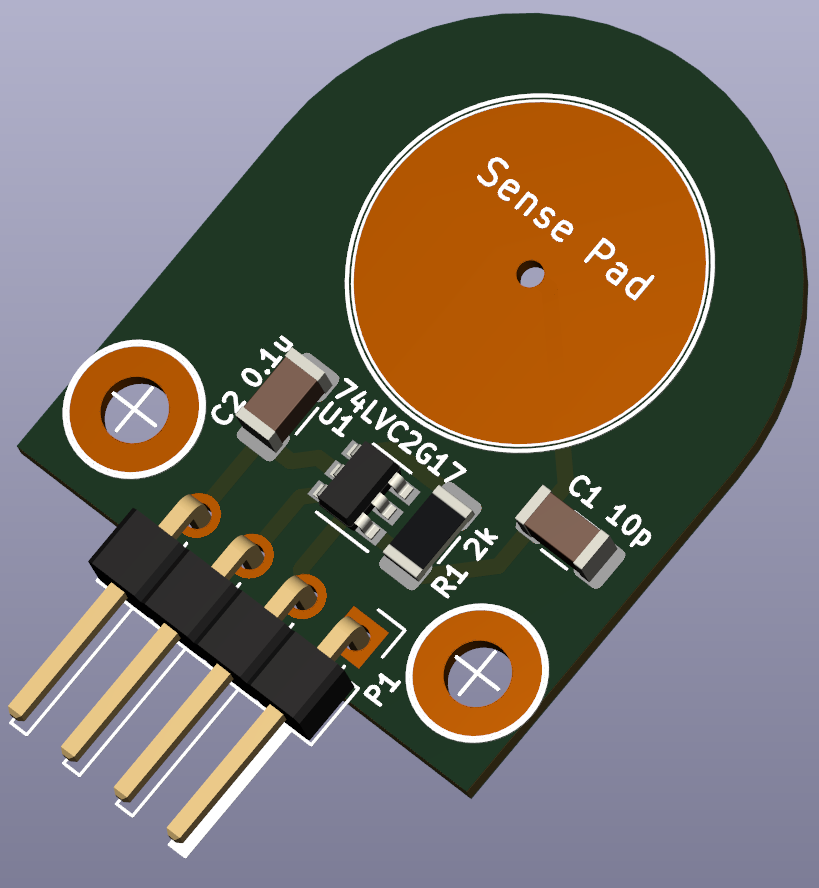
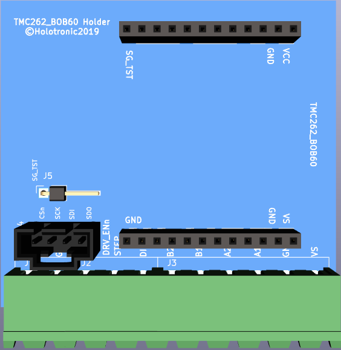
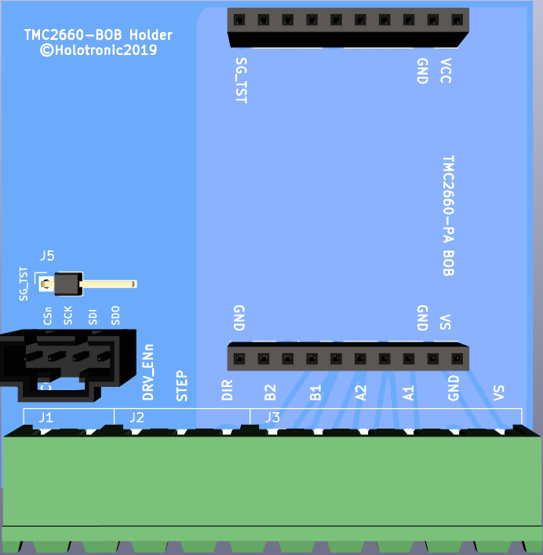

# socfpga-kicad
Hardware addons for mksocfpga

Schematic for GPIO -> Cramps Interface

[Cramps2_nano-soc2_pcb 3D view](Cramps2nano-soc/Cramps2_nano-soc2_pcb.stl)

---

Schematic and pcb designs for Capasitive touch sensor (for depth probing)

PCB's can be ordered from SeeedStudio:
https://www.seeedstudio.com/Capsense-Touchsense-g-1222872

---
Trinamic BOB mounting pcb's

---  

